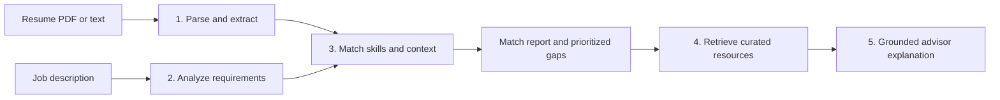

# AI Career Intelligence Platform

An end-to-end, local-first career analysis tool. It turns a resume and job description into a weighted match report, explains priority skill gaps, and lets users retrieve curated learning resources for those gaps.

The project is deliberately transparent: the output exposes strong, partial, and missing skills as well as the supporting signals behind the overall score. The React dashboard is backed by a FastAPI API, so the same pipeline can be exercised through the UI, REST endpoints, or tests.

## Project status

This is a complete V1 production-style prototype: the core pipeline is implemented, tested, and usable locally from the dashboard or API. It is not presented as a fully deployed production product. Deployment, formal evaluation, and several intentionally scoped extensions remain future work.

The stable matching checkpoint is tagged `matching-v2-stress-tested` at commit `7f0309d`.

## Pipeline



### Five phases

1. **Resume understanding**: PyMuPDF extracts PDF text, then the resume service produces structured skills, experience, projects, education, and summary data.
2. **Job analysis**: keyword extraction identifies known skills while sentence-transformer semantic detection supplements the result. Requirements are classified as required or preferred, and title and experience level are inferred.
3. **Matching**: candidate skills are compared with job skills using embeddings, curated vocabulary expansion, explicit equivalents, and per-skill thresholds. The report combines skill fit with project, experience, education, and whole-text relevance.
4. **Career knowledge retrieval**: missing skills query curated local documents through sentence-transformer embeddings and a persisted FAISS index. Retrieval happens before any generation.
5. **Grounded advice**: the advisor uses the retrieved resource and candidate context to request a focused learning explanation from the local Ollama-backed generator.

## Architecture decisions

- **Keyword plus semantic extraction** keeps explicit terms visible while allowing related phrasing to be detected.
- **Per-skill acceptance thresholds** are safer than one permissive global threshold. Generic cloud and agent concepts are especially prone to semantic false positives.
- **Curated vocabulary expansion** makes abbreviations and known concepts comparable without treating every nearby embedding as a skill.
- **Required skills weigh twice as much as preferred skills** in the skill score (`1.0` versus `0.5`).
- **Retrieval precedes generation** so the advisor has a concrete, inspectable source instead of inventing a resource.
- **Blocking advisor responses** keep the API contract simple and make timeout or unavailable-model errors visible to both the dashboard and callers.
- **Sentence Transformers plus FAISS** provide local semantic representations and vector retrieval without a hosted search dependency.
- **Deterministic extraction and matching** handle explicit terms and scoring where predictable behavior matters; LLM generation is used only for the personalized explanation.
- **Direct FAISS and `httpx` integration** keeps retrieval and Ollama calls explicit rather than claiming LangChain orchestration that this project does not use.

## Stress testing and debugging

The matching engine was tested against adversarial job descriptions rather than only the demo path. The most important finding was a vocabulary coverage gap, not a faulty matching algorithm:

1. Explicit skills such as Excel, Tableau, and Selenium disappeared because unknown terms were silently omitted from the taxonomy.
2. With those concepts absent, broad semantic inference filled the gap and produced phantom matches such as Azure.
3. Expanding the taxonomy fixed the missing requirements, while stricter thresholds for generic cloud and agent terms reduced false positives.
4. Regression tests cover both directions, and the follow-up pass generalized the result across the other failing cases, including GraphQL, REST APIs, and DevOps terminology.

The debugging process also caught two test-infrastructure hazards: a stale server process that produced a false negative and a PowerShell batch that contained literal `` `n `` text instead of newlines. Both were rerun cleanly before results were trusted.

The validation work also covers explicit handling for an unavailable Ollama model and negative or empty retrieval results. Regression tests were rerun after each matching fix so the improvements generalized beyond the original examples rather than masking one case.

## Known limitations

These are bounded backlog items, not unverified failures:

- `ML` is not yet normalized to Machine Learning in every extraction path.
- GraphQL is not currently in the skill taxonomy.
- Tool-to-category equivalence is limited; for example, Prometheus is not automatically treated as Monitoring and Terraform is not automatically treated as Infrastructure Automation.
- Semantic matching can still over-match terms such as Node.js in an unrelated frontend context and needs further threshold tuning.
- Project and experience prose contributes to relevance scoring, but prose-only skills are not yet added to the explicit skill-match list.
- The initial RAG corpus is intentionally small and curated, so retrieval coverage is limited.

## Explicitly deferred

- Multi-agent orchestration
- Formal labeled evaluation and benchmarking
- Docker or other containerization
- Production deployment
- PDF resume upload through the React dashboard (PDF parsing remains available through the API)

## Dashboard

The current React dashboard accepts pasted resume text and a pasted job description. After analysis, it displays the match score, supporting signals, strong skills, and priority gaps. Selecting a priority gap retrieves a relevant career resource and sends its context, together with the candidate background, to the local Ollama advisor. PDF resume parsing is available through the API but is not currently wired into the dashboard.

### Demo flow

1. Start the backend and frontend using the instructions below.
2. Paste resume text and a target job description into the dashboard.
3. Run the analysis to view the weighted match score, supporting signals, strong skills, and priority gaps.
4. Select a priority gap to retrieve a curated resource and request grounded learning advice from Ollama.

## Tech stack

| Area | Technology |
|------|------------|
| API | FastAPI, Pydantic, Uvicorn |
| PDF parsing | PyMuPDF |
| NLP and matching | scikit-learn, NumPy, sentence-transformers |
| Retrieval | FAISS, curated RAG documents |
| Generation | Ollama via the local advisor service |
| Frontend | React 19, TypeScript, Vite |
| Testing | pytest, pytest-asyncio, FastAPI TestClient |

## Project structure

```
backend/app/       FastAPI routes, schemas, and application services
ml/                Embeddings and semantic skill detection
rag/               Document retrieval and grounded generation
frontend/          React dashboard
data/              Curated knowledge base and uploaded files
models/            Persisted FAISS index and knowledge metadata
tests/             API, extraction, matching, and retrieval tests
```

## Run locally

### Backend

```powershell
python -m venv .venv
.venv\Scripts\Activate.ps1
pip install -r requirements.txt
uvicorn backend.app.main:app --reload --host 0.0.0.0 --port 8000
```

The API documentation is available at http://localhost:8000/docs and the health check is at http://localhost:8000/health.

### Ollama advisor

Install [Ollama](https://ollama.com/), make sure it is running, and pull the model configured by the application before using advisor explanations. The default setup is typically:

```powershell
ollama serve
ollama pull llama3.2
```

If Ollama is unavailable, the API reports the advisor failure explicitly instead of silently fabricating grounded advice. Retrieval and matching remain independently testable.

### Frontend

In a second terminal:

```powershell
cd frontend
npm install
npm run dev
```

The Vite development server normally runs at http://localhost:5173. The frontend expects the backend at `http://localhost:8000`.

### Tests

```powershell
python -m pytest tests/ -v
```

The current regression baseline is **41 passing tests**. The suite covers resume parsing, job analysis, matching behavior, API routes, RAG documents, and vector-store retrieval.

## API surface

| Method | Endpoint | Purpose |
|--------|----------|---------|
| GET | `/health` | Health check |
| POST | `/api/resume/parse` | Parse an uploaded PDF resume |
| POST | `/api/resume/parse-text` | Parse pasted resume text |
| POST | `/api/job/analyze` | Extract and classify job requirements |
| POST | `/api/match/skills` | Match skill lists directly |
| POST | `/api/match` | Generate a report from structured inputs |
| POST | `/api/match/from-text` | Run the complete text-to-report pipeline |
| POST | `/api/knowledge/search` | Retrieve curated resources |
| POST | `/api/advisor/explain` | Generate grounded advice for a skill gap |

## Checkpoint

The stress-tested matching milestone is tagged `matching-v2-stress-tested` at commit `7f0309d`. The worktree was clean when the checkpoint was created.

## License

MIT
